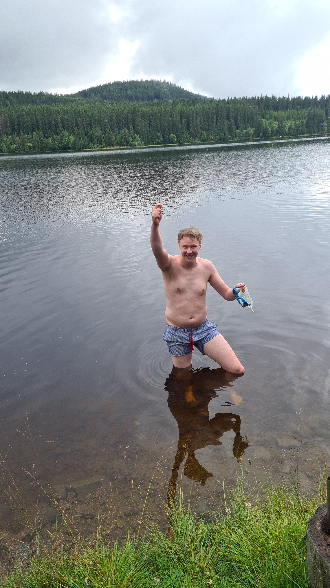

I naturskjønne omgivelser i Krokskogen i Nordmarka var det duket for historiens første avstemning av beste lagnavn _før_ sesongen begynner!
Dette ble selvfølgelig innført for å hindre taktisk stemming på slutten av sesongen, som kan eller ikke kan ha vært et problem tidligere år.

Vi ankom hytta på fredag ettermiddag og kveld, først var Markus, Simen, Martin og Eivind (med bil lol),
deretter kom Henrik og Anders på sykkel 💪. Bilgutta disket opp med sårt trengt fransk pasta à la Sïmén 👨‍🍳🇫🇷, noe som ble meget godt mottatt,
spesielt av litt underernærte syklister.

### - Valg må tas

På kvelden ble det Secret Hitler, der de liberale nok fikk en alt for enkel jobb med å skjønne at Hitler var helt borte vekk begge ganger på rad.
Valg måtte tas, og Eivind valgte å dra hjem 🥸 (han hadde sikkert en god grunn)

Lørdagen startet dårlig med tap for Japan i fotball-VM, med en meget svak prestasjon av de norske damene 😥
Været var rimelig dårlig så istedenfor å gå ut på tur, klinte vi til med Markus sin evige våte drøm - poker.\
Resultat: Markus 📈, resten 📉

### My precious

Heldigvis letta været så vi kunne ta turen ned til vannet og bade. Badeturen ble stort sett preget ev én ting, nemlig Martins
360 sidespin no-scope backflip fra stupebrettet. Dette imponerte Henrik så mye at han bestemte seg for å sparke av Anders
sin giftering med tærne sine, i vannet. Det var kanskje ikke med vilje, men det var jo litt kjipt forsåvidt så vi prøvde å finne ringen da.
Med grumsete, vanskelige grunnforhold, og etter _timesvis_ med leting og god hjelp fra alle, inkludert Damtjerns store sønn, Atle,
fant Markus utrolig nok ringen i et siste Hail-Mary-forsøk (bilde nederst)! Anders ble glad - så glad faktisk at han ga Markus
hele 1.69 Milapoeng. Hvordan dette medregnes i totalsummen på slutten av sesongen, må nesten være opp til sekretæriatet ✍🏻

### Avstemning: Beste lagnavn

Men så til helgens største event: Avstemning av beste lagnavn 🏆 På dette tidspunket hadde også Malte joinet gjengen på hytta via buss,
da sjåfør Sam hadde blitt syk. På tide å få seg lappen, Malte? 🏎️

Markus og Simen hadde laget i stand et valglokale der én og én ble presentert med alle lagnavn, uten å vite hvem de hørte til.
Deretter skulle vi rangere dem fra best til verst, samtidig som vi filmet oss selv (🤤) for å fange opp førsteinntrykket vårt.
Lykke til med redigeringsjobben, noen! 😃 (Det var også visstnok en shot i lokalet, men hvem vet).

### Resultatet

Det var bred enighet om at årets deltakere hadde rekordsterke lagnavn, og etter en nervepirrende opptelling, kunne valget erklæres gyldig!

**Vinneren ble Simen med sine "Milaysian bucket boys", og hanker dermed inn hele 5 Milapoeng! Gratulerer! 🇲🇾🪣👦🏻**

På andre plass finner vi Sam med hans "$jeik og betalt", og på tredje har vi Maltes "The KaneSaw Massacre".
De tar med seg henholdsvis 3 og 1 poeng inn i sesongen.

På de tre siste plassene finner vi Martins "AC Mila" på 7., Henriks "Masturbinho" på 8. og Mikkels "Milady's Cmilax", aka "Semilaksen", på 9.

Det er mye man kan si om de ulike navnene, men at Henriks Håndjagere skulle tilhøre en annen enn Henrik,
og Skodad Octavia skulle tilhøre en annen enn Octavia-pappaene - det var overraskende.

At Milady's Cmilax gjorde det såpass svakt var ingen overraskelse for hyttedeltakerne der og da, men navnet har muligens vokst på oss i ettertid?
Så som alle store kunstnere kan kanskje ikke heller Mikkel høste anerkjennelse i sin tid.

Et annet notat undertegnede gjør seg er at 6 av 9 spillere i ligaen har fornavn på 6 bokstaver, og de 3 resterende har færre bokstaver
og havnet samtidig på de 3 øverste plassene.. Collusion?!? 🤔 VAR?!?⚠️

Her er tabell, nå tar jeg kveld.

| Plassering | Playah | Lagnavn               | Milapoeng |
| :--------- | :----- | :-------------------- | :-------- |
| 1 👑       | Simen  | Milaysian bucket boys | 5         |
| 2          | Sam    | $jeik og betalt       | 3         |
| 3          | Malte  | The KaneSaw Massacre  | 1         |
| 4          | Anders | SplitteMilaBramseil   | 0         |
| 5          | Eivind | Henriks Håndjagere    | 0         |
| 5          | Markus | Skodad Octavia        | 0         |
| 7          | Martin | AC Mila               | -1        |
| 8          | Henrik | Masturbinho           | -2        |
| 9 💩       | Mikkel | Milady's Cmilax       | -3        |

