### GW31 - Martin på MilaAwards - Martin
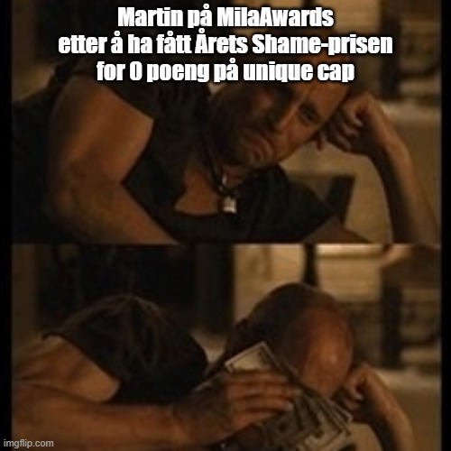

### GW30 - Mikkel og Henrik imponerer stort i FPL i år - Simen
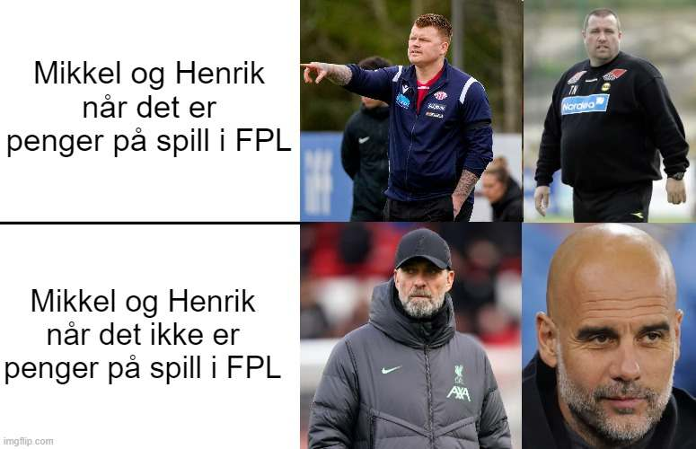

### GW25 - Martin elsker Douglas Luiz - Eivind
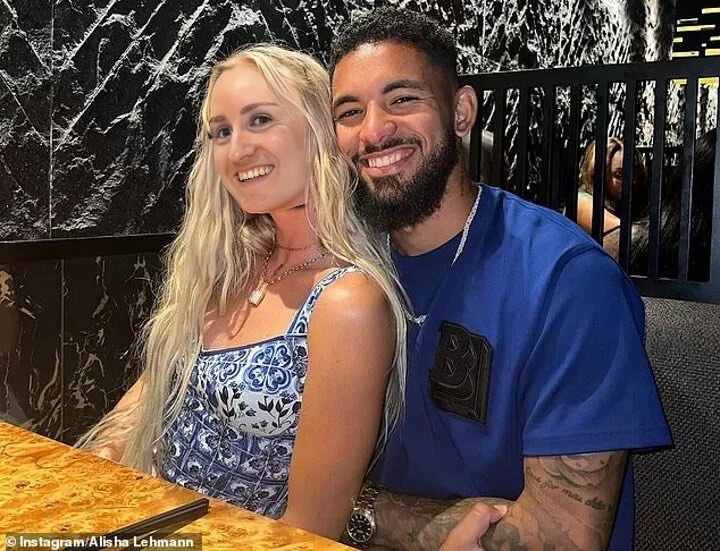

### GW20 - Sam roter med chattene - Simen
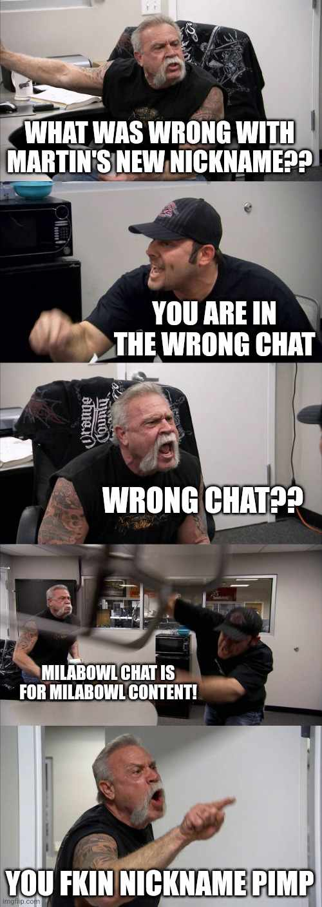

### GW18 - Når du lager memes før kampen er ferdig - del 2 - Simen
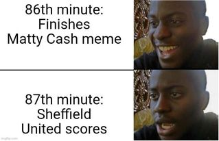

### GW18 - Når du lager memes før kampen er ferdig - del 1 - Simen
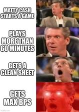

### GW 12 - Mikkel som arkiveringsansvarlig - Eivind
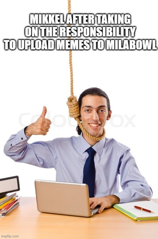

### GW 12 - Escalation - Sam
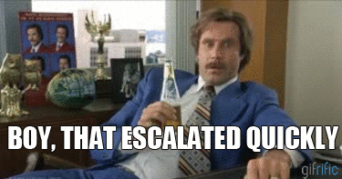

### GW 12 - Bug reverse - Malte
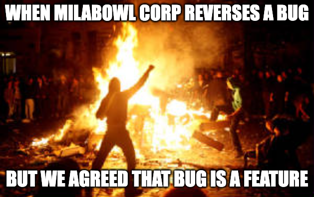

### GW 12 - No fun - Anders
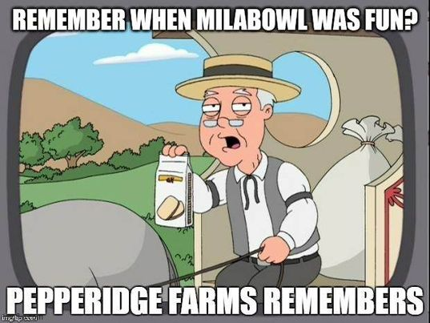

### GW 12 - Red card - Sam
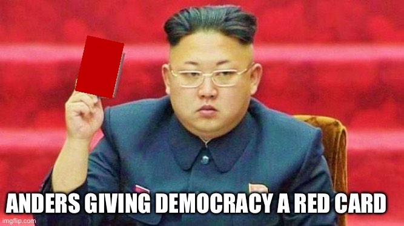

### GW 12 - Misliker at Sellout faktisk ble implementert - Anders
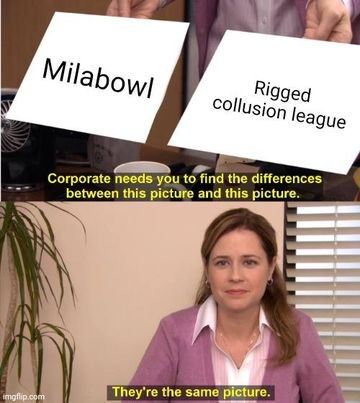

### GW 12 - Hackathon hype - Sam
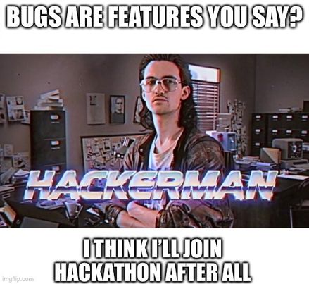

### GW 12 - Mikkel er awesome i FPL, men har hatt litt uflaks i Milabowl - Simen
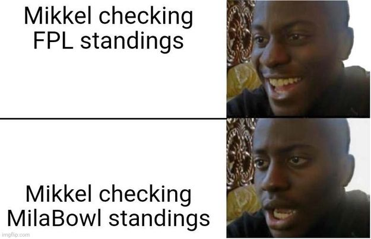

### GW 12 - Eivind er desperat og tyr til selvjinx som last resort!? - Simen

### GW 11 - Milalead on wish list - Sam
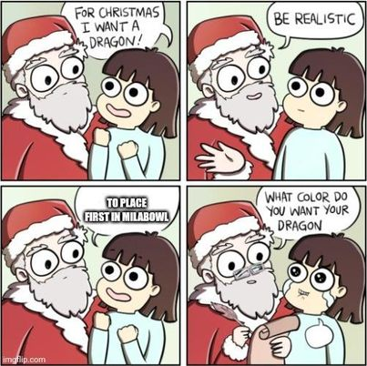

### GW 11 - Malte tar en rolig MilaGW - Simen
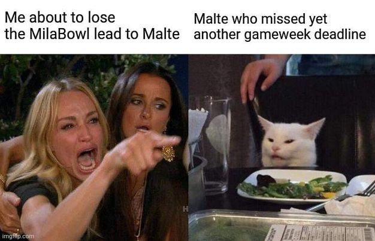

### GW 11 - Gordon får 0 BPS, til tross for kampens eneste mål - Simen
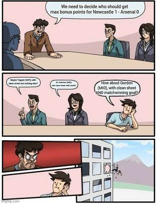

### GW 10 - Sam godter seg med Eivinds dårlige meme-game - Sam
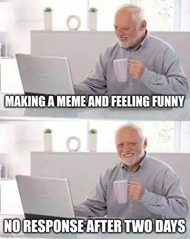

### GW 10 - 0 reactions på forrige meme forsøk (som ikke var morsomt). Får dessverre én trøstereaksjon fra Martin - Eivind
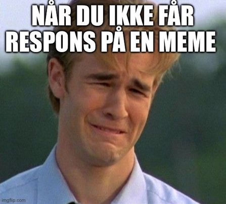

### GW 10 - Simen tar gledelig imot 🍌 - Simen
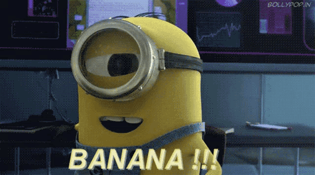

### GW 10 - Eating bananas like Champ's - Sam
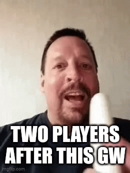

### GW 10 - Mikkel sutrer for glemt frist 👶 - Simen
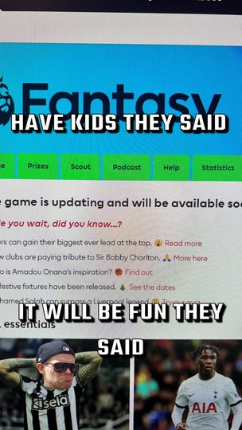

### GW 9 - Sien feiler på en Maddison Jinx som ender på 9pts - Sam
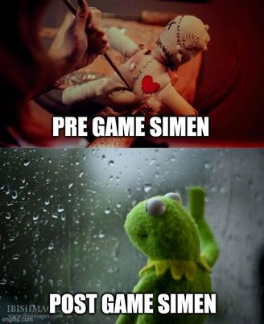

### GW 8 - Banana rules baserer seg på FPL- og ikke milrank - Simen
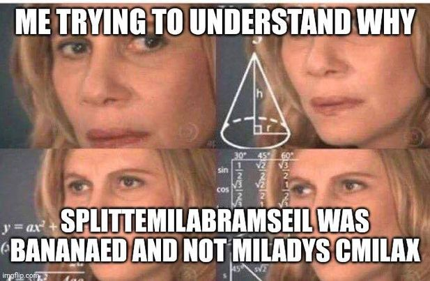

### GW 8 - Martin og Eivind kjører template WC, men liker ikke å bli callet ut på det! - Sam
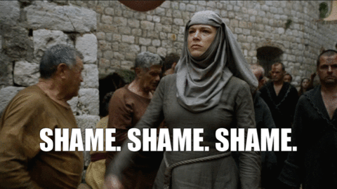

### GW 7 - Når sprenger bomben? 💣 - Sam
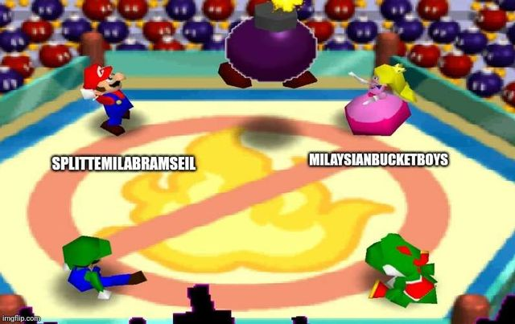

### GW 7 - Det er mye som er vondt å svelge tidlig i sesongen - Sam

### GW 7 - Semilaks har startet sesongen med gode predictions - Sam
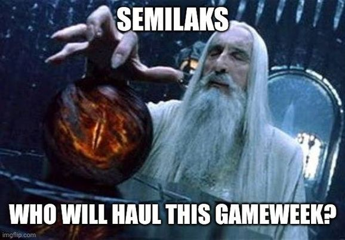

### GW 4 - Sam lanserer oppdatert Milabowl.com! - Mikkel
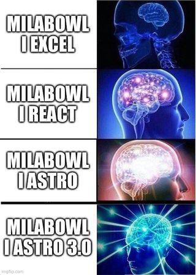

### GW 4 - Colonizing Mars. MilaCorp innoverer i et forrykende temp. - Sam
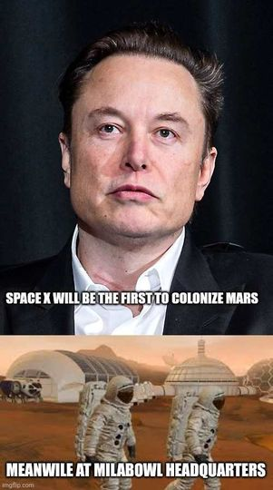

### GW 4 - Sagaen om bombebattle e.III - Sam
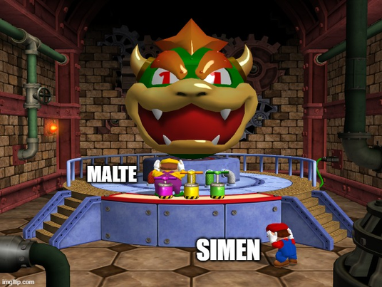

### GW 4 - Onanana gjør det dårlig - Sam
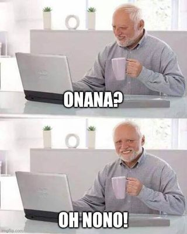

### GW 4 - Gabriel varmer benken igjen - Sam
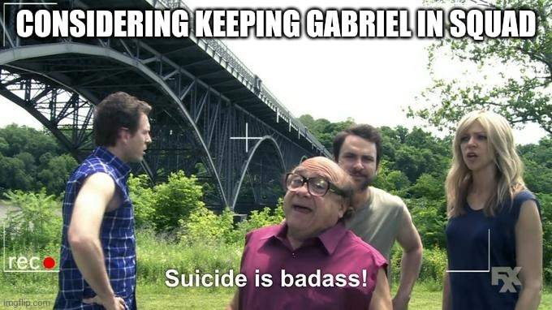

### GW 4 - Udogie blanker - Sam
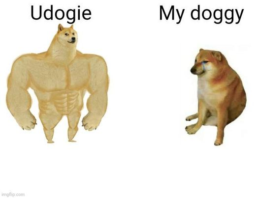

### GW 3 - Semilaks begynner sterkt men ingen har troen videre - Sam
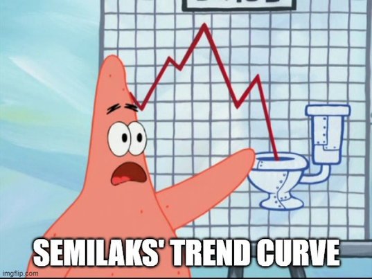

### GW 3 - Peproulette offer - Sam
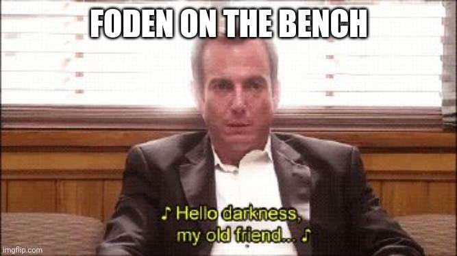

### GW 3 - Bombebattle mellom Malte og Simen 💥 - Sam
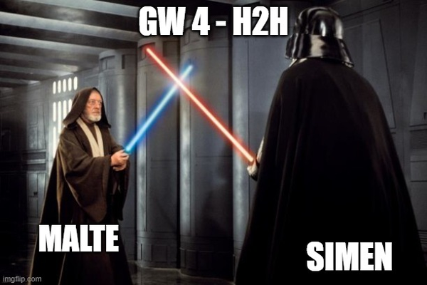

### GW 3 - Eivind forsøker seg på en bombjinx - Eivind

### GW 2 - FPL bets are placed ihht MiLaw §6 ledd 9 - Sam

### GW 2 - Creds til Kingmememe's meme game - Eivind
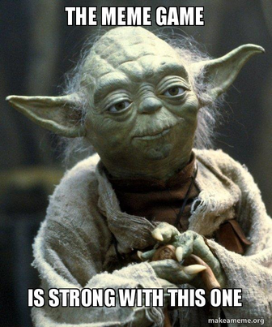

### GW 2 - Forvirring rundt milabomb og darth mila - Sam
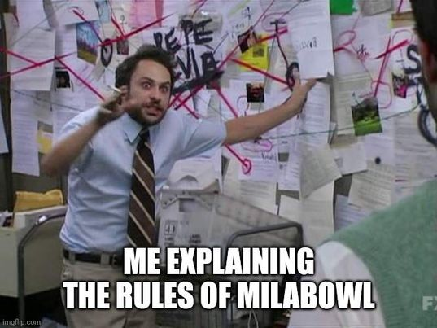

### GW 2 - Mange template teams - Sam
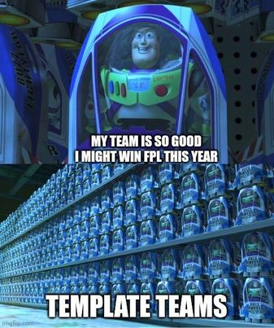

### GW 1 - Milahype i starten av sesongen! - Sam
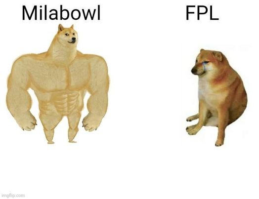

### GW 1 - Antakelse om at Henrik gjør endringer rett før start - Kingmeme
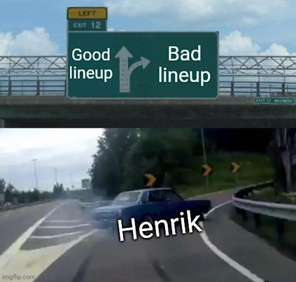

### GW 1 - Simen er fremdeles ikke sikker på seson-lineup - Anders
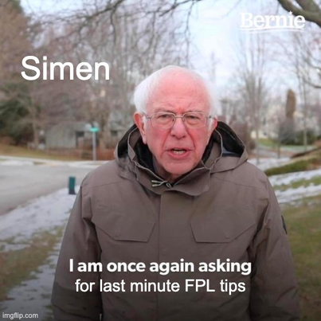

### GW 1 - Simen kommer i siste liten - Sam
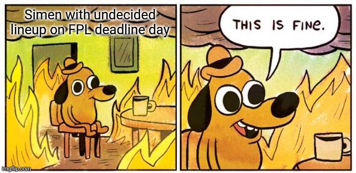

### GW 1 - Usikkerhet rundt uttale av climax - Anders
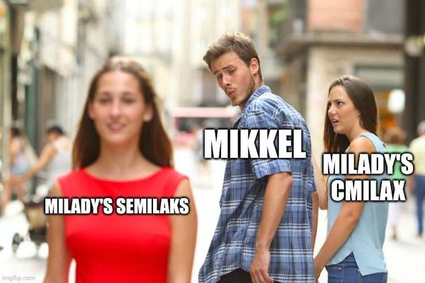

### GW 1 - Sam og Eivind kan ikke skjønne hvordan Henrik's Håndjagere ikke var årets beste navn - Sam
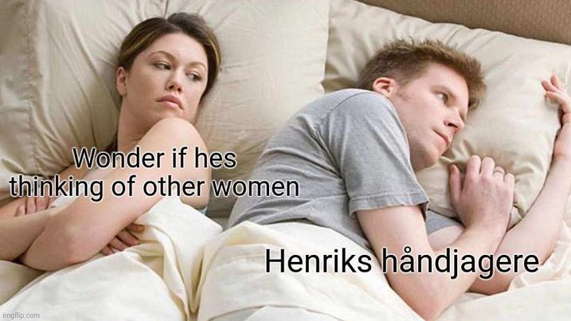

### GW 3 - Stick in wheel. Bytte ut Fernandes som får 12 poeng - Eivind
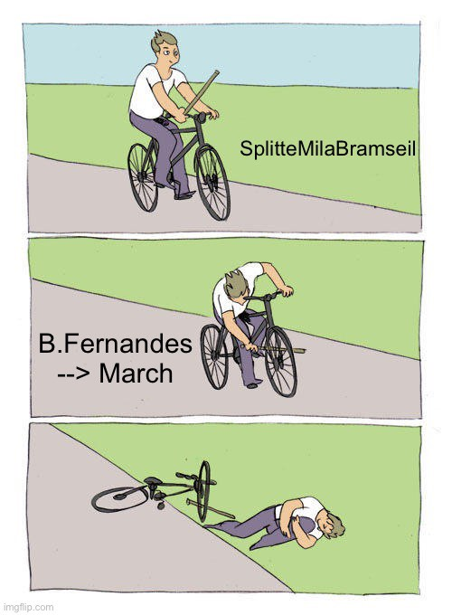

### GW 2 - milablowl.no? - Markus
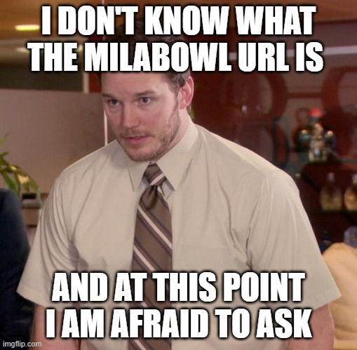

### GW 2 - Waiting... - Semilaks
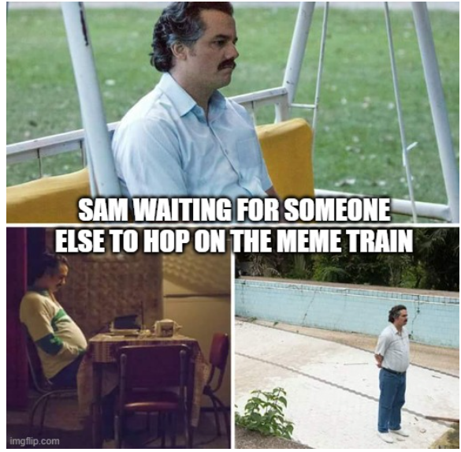

### GW 2 - Semilaks on top - Sam
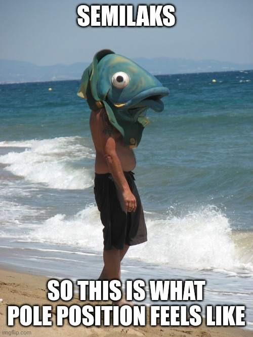

### GW 1 - Implications... ⁉️ - Sam
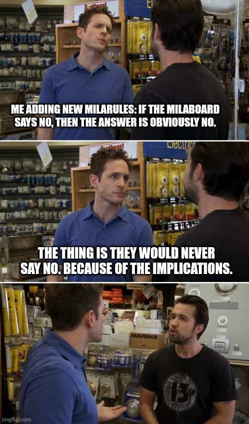

### GW 1 - Mubama? - Sam
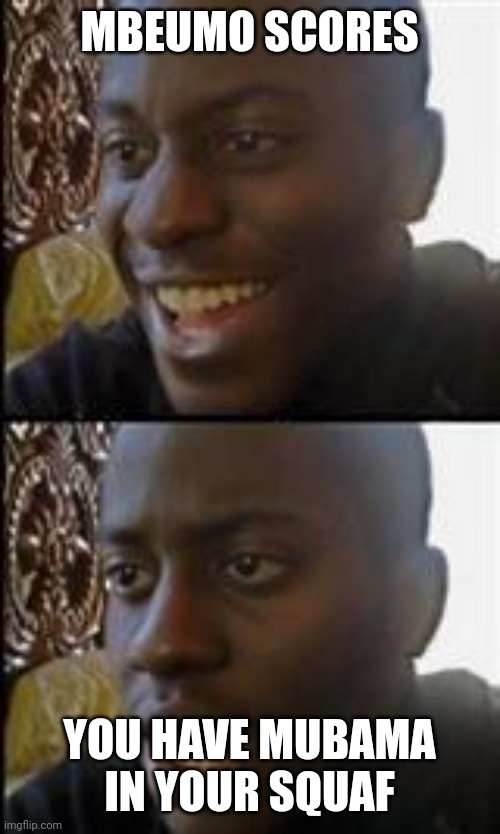

### GW 1 - Squaf - Anders
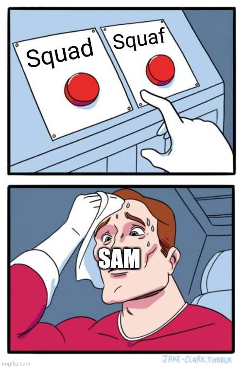

